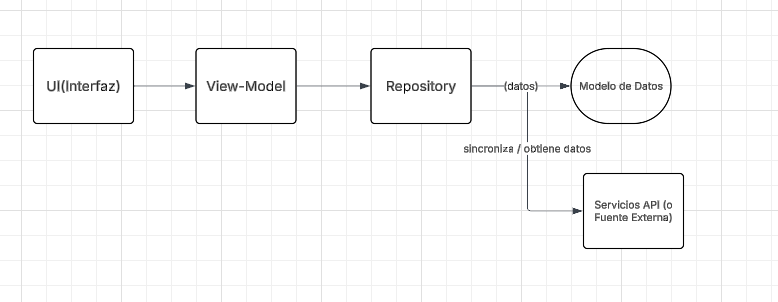

## Arquitectura del Sistema

### Tipo de Aplicación

Aplicación Nativa para Android
La aplicación está desarrollada con Kotlin y Jetpack Compose, lo que asegura un rendimiento optimo, 
acceso a las últimas funciones de Android y una experiencia de usuario de alta calidad.

### Patron de Arquitectura Seleccionado

MVVM (Model view view-Model)

Para esta prueba de concepto seguimos el patron MVVM para asegurar una separación clara de responsabilidades, 
haciendo que la aplicación sea fácil de mantener y probar.

### Modelo Representa la estructura de los datos (Espacio de Coworking).

Vista Compuesta por las pantallas de Jetpack Compose que reaccionan a los cambios en el estado.
Vista-Modelo Gestiona el estado y la lógica de la interfaz de usuario, entregando los datos a las pantallas.

### Justificación Técnica

MVVM es el estándar más común usado en la industria para el desarrollo de Android con Jetpack Compose. 

Que permite:

1 Flujo de Datos Unidireccional Simplifica la gestion del estado.
2 Reutilización Los componentes de la interfaz ya que son independientes de la lógica de negocio.
3 Escalabilidad Fácil de integrar cambios como ejemplo fuentes de datos reales o persistencia local en el futuro.

### Diagrama de Arquitectura

UI (Interfaz) -> Vista-Modelo -> Repositorio (Datos Simulados) -> Modelo de Datos

 

El Flujo General que tiene el Sistema

1 El usuario abre la aplicación y ve el listado de espacios de coworking.
2 La interfaz solicita los datos a la Vista-Modelo, el cual los obtiene de un proveedor de datos simulados.
3 El usuario selecciona un espacio y el componente de navegación gestiona la transición a la pantalla de detalle.
4 La pantalla de detalle muestra la información ampliada del espacio seleccionado.
5 Los usuarios pueden navegar entre secciones usando la barra inferior.
6 El usuario puede realizar una simulación de reservación desde la pantalla de detalle.
